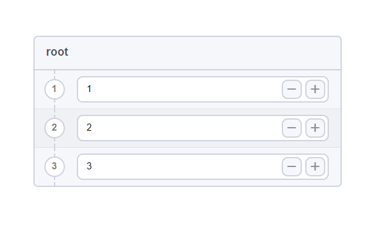

# guifier

An interactive front-end toolkit simplifying JSON, YAML, TOML, and XML data. Visualize, edit, convert formats, and perform real-time data manipulations. Empower your data-driven apps with user-friendly data processing and interactive visualization.

## Getting started
### Installing
By executing this command on your npm project, you can effortlessly install guifier.
```
npm install guifier
``` 
### Hello world example
Below, you'll find an example demonstrating how to generate an HTML representation based on the data you provided to the Guifier class.
```js
const jsonString = '{
  "name": "Alice",
  "age": 25,
  "isStudent": true,
  "hobbies": ["reading", "painting"],
  "address": {
    "city": "London",
    "zipcode": "SW1A 1AA",
    "country": "United Kingdom"
  }
}'

const params = {
    // To select a container element, you can use a selector
    // such as a hashtag followed by the element's id (similar to CSS selectors).
    elementSelector: '#app',
    // Here, you need to specify the JSON string.
    data: jsonString,
    // You should specify the data type (in this case, JSON)
    // as Guifier supports five data formats: 'json', 'yaml', 'xml', 'toml' and 'js' (javascipt object).
    dataType: 'json'
}

const guifier = new Guifier(params)
```

That's it! When you execute this code, it will parse your data, generate an HTML GUI, and paste it into the element you selected using the elementSelector property of the params.


This GUI will allow you to visualize and edit your JSON data easily. Once you've made the necessary modifications, you can obtain the edited version of your JSON data simply by executing this Guifier method.

```js
// The first parameter is used to indicate the data format in which you wish to receive your data.
const editedData = guifier.getData('json')
```

We offer support for exporting data in five formats: 'json', 'yaml', 'xml', 'toml' and 'js'. Therefore, you can import your data as JSON, make the necessary edits, and then export it in the desired format, such as TOML, YAML, XML or native javascript object.

If you wish to modify the data displayed in the GUI representation, you can execute the method.

```js
// The first parameter is used to indicate the data format in which you wish to set your data.
guifier.setData('[1,2,3]', 'json')
```

After executing this method, your GUI representation element will be updated to accommodate your new data.



